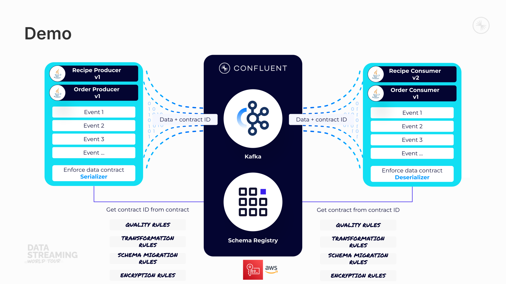

# 🍝 Byte to Eat: A Streaming Kitchen Data Contracts Demo

Welcome to **Byte to Eat**, the tastiest way to explore **Data Contracts** in action!
This demo simulates a restaurant kitchen running on **Confluent Cloud**, showcasing how **data contracts** work to manage recipe and order events.

## 👨‍🍳 What’s on the Menu?

This project demonstrates **4 key capabilities of Data Contracts**:

1. **Data Quality Rules** – Ensuring only valid recipes and orders get into the kitchen.
2. **Data Transformation Rules** – Ensuring data is in the right format before cooking.
3. **Schema Migration Rules** – Evolving schemas while ensuring no recipe goes bad.
4. **Data Encryption Rules** – Keeping pii information safe.

### 🍲 How It Works

- **Recipe Producer**: Sends recipe details, including ingredients, steps, and chef info to the Kafka topic in Confluent Cloud.
- **Order Producer**: Simulates customer orders referencing recipes by their `recipe_id`.
- **Kafka Consumers**: Consume orders and recipes, validating and transforming the data based on Avro schemas.
- **Schema Registry**: Ensures proper validation and schema management for the recipes and orders.

#### Demo Architecture


#### Demo Recording
See the `demo-recording-480p.mp4` file in the directory


### 🔧 Built With

- **Java**: Kafka Producers & Consumers
- **Confluent Cloud**: The data streaming platform
- **Confluent Schema Registry**: Manages Data Contracts
- **Flink**: To join the Recipe and Order events
- **Avro**: Used to define the Schema

### 🚀 Demo Flow


1. **Clone the Repo**
   [`git clone https://github.com/wvella/byte-to-eat.git`](https://github.com/wvella/java-demo-data_contracts-bytetoeat.git)

2. **Setup Variabes via Terraform**
   1. Create a `terraform.tfvars` in the `terraform/confluent-cloud` directory with the following contents:

      ``` env
      confluent_cloud_api_key = "<<confluent_cloud_api_key_for_terraform>>"
      confluent_cloud_api_secret = "<<confluent_cloud_api_secret_for_terraform>>"
      aws_kms_key_arn = "<<arn for the key in AWS KMS>>"
      ```

3. **Deploy the Demo**
   1. Run `./terraform-apply.sh`. This script will deploy all the resources in Confluent Cloud and produce a Spaghetti Bolognese recipe to the topic. 🍝 Yum!
   2. Grant Confluent access to the Key in AWS KMS by applying the policy directly on the key in KMS.
      1. TODO: Automate this manual step!

4. **Flow**
   1. **PrePreparation**
      1. Open VSCode
      2. Ensure Docker is running
      3. Open `ProducerAvroRecipe.java`
      4. Open `data-governance.tf`
      5. Log into Confluent Cloud
      6. Open `schema-raw.recipe-value-v2.avsc`
      7. Open 4 Terminal Windows and `cd java-demo-data_contracts-bytetoeat`:
         1. Window 1: V1 Producer (White Background)
         2. Window 2: V2 Producer (Black Background)
         3. Window 3: V1 Consumer (White Background)
         4. Window 4: V2 Consumer (Black Background)
   2. **Data Quality Rules**
      1. Show `require_more_than_one_ingredient` rule definition in Terraform `data-governance.tf` / Confluent Cloud UI.
      2. Demonstrate by trying to produce a recipe that violates the rule by running `./run-producer-recipe.sh false` in the `byte-to-eat-v1` directory.
      3. Show the bad message ending up in the `raw.recipes.dlq` topic.
   3. **Data Transformation Rules**
      1. Show `transform_recipe_name_to_valid_recipe_id` rule definition in Terraform `data-governance.tf` / Confluent Cloud UI.
      2. Show the recipe id in the Java Code `ProducerAvroRecipe.java` in the `byte-to-eat-v1` directory.
      3. Show how the recipe ID is transformed when it's written to the `raw.recipe` topic via the Data Transformation rule.
   4. **Data Encryption Rules**
       1. Show the `Orders` Data Contract in the Confluent Cloud UI. Orders have some PII tags.
       2. Show the `ProducerAvroRecipe.java` application. There is no Code to do the encryption, it just imports the `kafka-schema-rules` dependency.
       3. Show `encrypt_pii` rule definition in the Confluent Cloud UI.
       4. Show the `aws-kek-for-csfle` definition under `Stream Governance` -> `Schema Registry` -> `Encryption Keys`.
       5. Start up the `./run-producer-orders.sh` producer.
       6. Show the `raw.orders` topic to see the `customer_address` and `pii` field encrypted.
       7. In the Confluent Cloud UI, add another `pii` tag to `customer_name` show the schema is instant. No code changes.
       8. Show the `raw.orders` Topic in the Confluent Cloud UI to show the `customer_name` field is now encrypted.
       9. Start up the `./run-consumer-orders.sh` to see how a Java consumer can decrypt the field.
       10. **Bonus:** The consumer can only decrypt the field because it has access to the `aws-kek-for-csfle` key. Remove the access via the Confluent Cloud UI and the field won't be decrypted.
       11. **Bonus:** Flink is joining the `Orders` and `Recipes` together, and the encrypted field will be carried through.
   5. **Schema Migration Rules**
      1. Switch to the `byte-to-eat-v2` folder.
      2. In the Confluent Cloud UI, show the current version of the `raw.recipe-value` Data Contract which has `application.major.version` set to 1.
      3. Show `schema-raw.recipe-value-v2.avsc` which now has the `chef_first_name` and `chef_last_name` as seperate fields. This would be a breaking change.
      4. Run `register-migration-rules.sh` to register the new Data Contract and Migration Rules. Show `migration_rules.json`.
      5. Show the new `raw.recipe-value` Data Contract in the Confluent Cloud UI. `application.major.version` is now set to 2.
      6. Show the `split_chef_first_and_last_name` and `join_chef_first_and_last_name` migration rules in the Confluent Cloud UI.
      7. Force V1 to use the first version of the Schema. Set the `use.schema.id=` to the Schema ID of the first version in `byte-to-eat-v1\producer-recipe.template`
         1. Set `use.latest.version` to `False
      8. Start up the V1 consumer is Window 3 `./run-consumer-recipe.sh`
      9. Start up the V2 consumer is Window 3 `./run-consumer-recipe.sh`
      10. Start up the V1 producer in Window 1 `./run-producer-recipe.sh`. Observer the V1 and V2 consumer view of the data.
      11. Start up the V1 producer in Window 2 `./run-producer-recipe.sh`. Observer the V1 and V2 consumer view of the data.
   6. **Demo Cleanup**
       1. Run `./terraform-destroy.sh`.

### General Notes

- To generate the effective POM: `mvn help:effective-pom -Doutput=effective-pom.xml`
- To generate the Java Class from an AVRO Schema: `mvn generate-sources`

### 🛠️ Requirements

- **Java 11 or later**
- **Confluent Cloud** (Kafka and Schema Registry)
- **Terraform**
